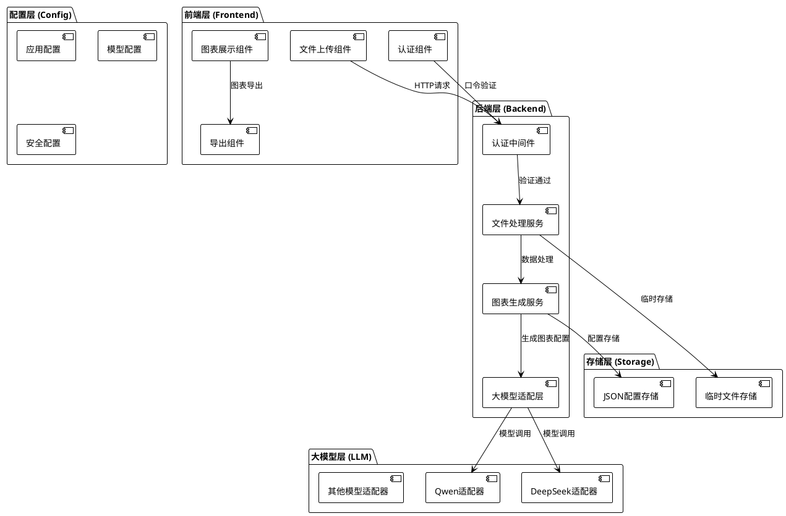
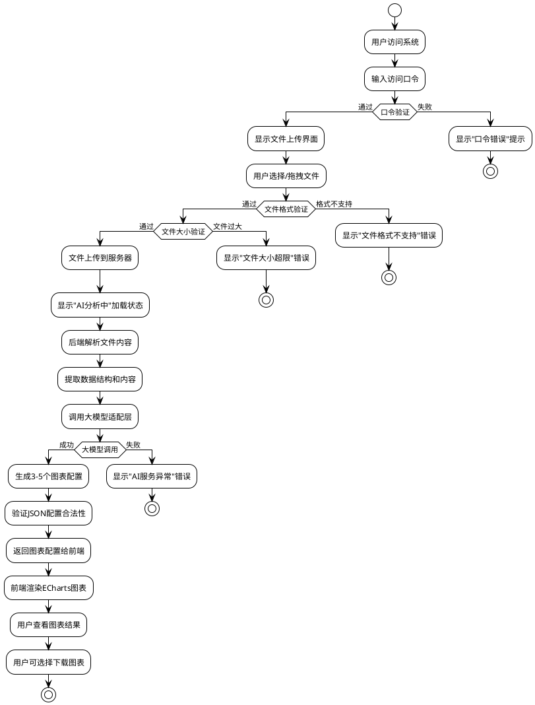
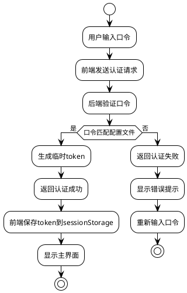
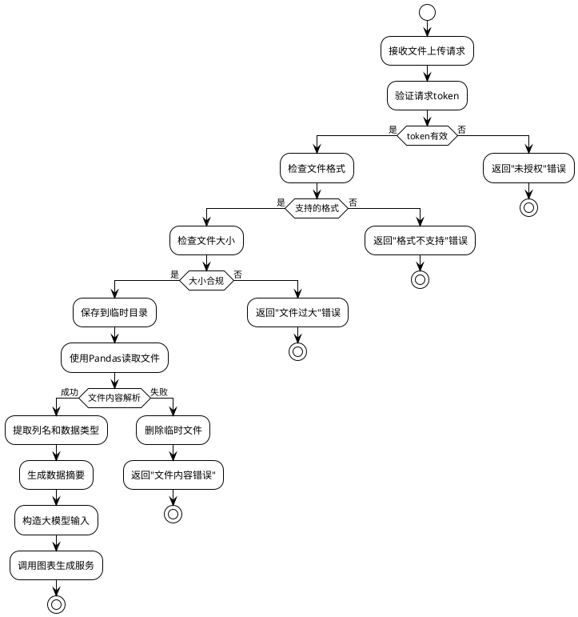

# InsightChart AI - 技术架构文档

## 1. 项目概述

InsightChart AI 是一个基于大语言模型的智能图表生成器，通过口令认证机制保护服务，支持用户上传Excel/CSV文件，自动生成多种类型的ECharts图表。

### 1.1 技术选型

| 技术栈 | 选择 | 版本 |
|--------|------|------|
| 前端框架 | Vue.js 3 | 3.4+ |
| 开发语言 | TypeScript | 5.0+ |
| 图表库 | Apache ECharts | 5.4+ |
| 后端框架 | Flask | 3.0+ |
| 后端语言 | Python | 3.9+ |
| 数据处理 | Pandas | 2.0+ |
| 大模型 | Qwen/DeepSeek | 统一适配层 |
| 容器化 | Docker | Latest |

### 1.2 核心特性

- 口令认证机制（无需用户注册登录）
- 支持多种数据格式（Excel、CSV）
- 统一大模型适配层，支持扩展
- 轻量级设计，无数据库依赖
- 配置文件化管理
- Docker容器化部署

## 2. 系统架构设计

### 2.1 整体架构图



### 2.2 模块拆分

#### 2.2.1 前端模块

```
frontend/
├── src/
│   ├── components/           # 组件库
│   │   ├── FileUpload/       # 文件上传组件
│   │   ├── Authentication/   # 认证组件
│   │   ├── ChartDisplay/     # 图表展示组件
│   │   └── ChartExport/      # 图表导出组件
│   ├── services/            # 服务层
│   │   ├── api.ts           # API调用服务
│   │   ├── auth.ts          # 认证服务
│   │   └── chart.ts         # 图表服务
│   ├── utils/               # 工具函数
│   │   ├── file.ts          # 文件处理工具
│   │   └── validation.ts    # 验证工具
│   └── types/               # 类型定义
│       ├── api.ts           # API类型
│       └── chart.ts         # 图表类型
```

#### 2.2.2 后端模块

```
backend/
├── app/
│   ├── core/                # 核心模块
│   │   ├── auth.py          # 认证中间件
│   │   ├── config.py        # 配置管理
│   │   └── exceptions.py    # 异常处理
│   ├── services/            # 服务层
│   │   ├── file_service.py  # 文件处理服务
│   │   ├── llm_service.py   # 大模型服务
│   │   └── chart_service.py # 图表生成服务
│   ├── adapters/            # 适配器层
│   │   ├── base_llm.py      # 大模型基类
│   │   ├── qwen_adapter.py  # Qwen适配器
│   │   └── deepseek_adapter.py # DeepSeek适配器
│   ├── api/                 # API层
│   │   ├── endpoints/       # 端点定义
│   │   └── dependencies.py  # 依赖注入
│   └── utils/               # 工具函数
│       ├── data_processor.py # 数据处理
│       └── validators.py    # 验证器
```

## 3. 业务流程设计

### 3.1 完整业务流程图



### 3.2 认证流程图



### 3.3 文件处理流程图



## 4. 接口设计

### 4.1 认证接口

#### POST /api/auth/login
**功能**: 口令认证
**请求**:
```json
{
  "password": "string"
}
```
**响应**:
```json
{
  "success": true,
  "data": {
    "token": "string",
    "expires_in": 3600
  },
  "message": "认证成功"
}
```

#### POST /api/auth/verify
**功能**: 验证token有效性
**Headers**: 
```
Authorization: Bearer <token>
```
**响应**:
```json
{
  "success": true,
  "data": {
    "valid": true
  }
}
```

### 4.2 文件处理接口

#### POST /api/file/upload
**功能**: 文件上传和图表生成
**Headers**:
```
Authorization: Bearer <token>
Content-Type: multipart/form-data
```
**请求**:
```
file: File (Excel/CSV文件)
```
**响应**:
```json
{
  "success": true,
  "data": {
    "charts": [
      {
        "id": "chart_1",
        "title": "图表标题",
        "type": "bar",
        "option": {
          // ECharts配置对象
        },
        "description": "图表描述"
      }
    ],
    "data_summary": {
      "columns": ["列1", "列2"],
      "row_count": 100,
      "column_types": {"列1": "数值", "列2": "文本"}
    }
  },
  "message": "图表生成成功"
}
```

#### GET /api/file/download-chart/{chart_id}
**功能**: 下载图表图片
**Headers**:
```
Authorization: Bearer <token>
```
**响应**: 图片文件流

### 4.3 系统信息接口

#### GET /api/system/health
**功能**: 系统健康检查
**响应**:
```json
{
  "success": true,
  "data": {
    "status": "healthy",
    "timestamp": "2025-08-24T10:00:00Z",
    "llm_status": "available"
  }
}
```

## 5. 大模型适配层设计

### 5.1 基础适配器接口

```python
from abc import ABC, abstractmethod
from typing import Dict, List, Any

class BaseLLMAdapter(ABC):
    """大模型基础适配器"""
    
    @abstractmethod
    def generate_charts(self, data_summary: Dict[str, Any]) -> List[Dict[str, Any]]:
        """生成图表配置"""
        pass
    
    @abstractmethod
    def validate_response(self, response: str) -> bool:
        """验证响应格式"""
        pass
    
    @abstractmethod
    def get_model_info(self) -> Dict[str, str]:
        """获取模型信息"""
        pass
```

### 5.2 模型配置结构

```python
# 配置文件: config/models.json
{
  "default_model": "qwen",
  "models": {
    "qwen": {
      "name": "Qwen",
      "api_key": "${QWEN_API_KEY}",
      "base_url": "https://dashscope.aliyuncs.com/api/v1",
      "model_name": "qwen-turbo",
      "max_tokens": 2000,
      "temperature": 0.7
    },
    "deepseek": {
      "name": "DeepSeek",
      "api_key": "${DEEPSEEK_API_KEY}",
      "base_url": "https://api.deepseek.com",
      "model_name": "deepseek-chat",
      "max_tokens": 2000,
      "temperature": 0.7
    }
  }
}
```

### 5.3 统一调用接口

```python
class LLMService:
    """大模型服务统一接口"""
    
    def __init__(self, model_name: str = None):
        self.adapter = self._get_adapter(model_name)
    
    def _get_adapter(self, model_name: str) -> BaseLLMAdapter:
        """获取适配器实例"""
        # 根据配置返回对应的适配器
        pass
    
    def generate_charts(self, data_summary: Dict) -> List[Dict]:
        """生成图表配置"""
        return self.adapter.generate_charts(data_summary)
```

## 6. 配置文件设计

### 6.1 应用主配置 (config/app.json)

```json
{
  "app": {
    "name": "InsightChart AI",
    "version": "1.0.0",
    "debug": false,
    "host": "0.0.0.0",
    "port": 5000
  },
  "security": {
    "access_password": "${ACCESS_PASSWORD}",
    "token_secret": "${TOKEN_SECRET}",
    "token_expires": 3600
  },
  "file": {
    "max_size_mb": 5,
    "allowed_extensions": [".xlsx", ".xls", ".csv"],
    "temp_dir": "./temp",
    "cleanup_interval": 3600
  },
  "llm": {
    "default_model": "qwen",
    "timeout": 30,
    "retry_times": 3,
    "max_charts": 5
  }
}
```

### 6.2 模型配置 (config/models.json)

```json
{
  "qwen": {
    "name": "Qwen",
    "api_key": "${QWEN_API_KEY}",
    "base_url": "https://dashscope.aliyuncs.com/api/v1",
    "model_name": "qwen-turbo",
    "max_tokens": 2000,
    "temperature": 0.7,
    "system_prompt": "你是一个专业的数据可视化专家..."
  },
  "deepseek": {
    "name": "DeepSeek", 
    "api_key": "${DEEPSEEK_API_KEY}",
    "base_url": "https://api.deepseek.com",
    "model_name": "deepseek-chat",
    "max_tokens": 2000,
    "temperature": 0.7,
    "system_prompt": "你是一个专业的数据可视化专家..."
  }
}
```

### 6.3 环境变量配置 (.env)

```bash
# 应用配置
ACCESS_PASSWORD=your_access_password
TOKEN_SECRET=your_jwt_secret_key

# 大模型API密钥
QWEN_API_KEY=your_qwen_api_key
DEEPSEEK_API_KEY=your_deepseek_api_key

# 可选配置
DEBUG=false
LOG_LEVEL=INFO
```

## 7. 数据存储设计

### 7.1 临时文件存储

```
temp/
├── uploads/          # 上传文件临时存储
│   └── {session_id}/
│       └── {filename}
└── charts/           # 生成的图表配置
    └── {session_id}/
        └── charts.json
```

### 7.2 会话数据结构

```json
{
  "session_id": "uuid",
  "timestamp": "2025-08-24T10:00:00Z",
  "file_info": {
    "filename": "data.xlsx",
    "size": 1024000,
    "type": "application/vnd.openxmlformats-officedocument.spreadsheetml.sheet"
  },
  "data_summary": {
    "columns": ["列1", "列2"],
    "row_count": 100,
    "column_types": {"列1": "数值", "列2": "文本"}
  },
  "charts": [
    {
      "id": "chart_1",
      "title": "图表标题",
      "type": "bar",
      "option": {},
      "description": "图表描述"
    }
  ]
}
```

## 8. 错误处理设计

### 8.1 错误码定义

```python
class ErrorCode:
    # 认证相关
    INVALID_PASSWORD = "AUTH_001"
    TOKEN_EXPIRED = "AUTH_002"
    TOKEN_INVALID = "AUTH_003"
    
    # 文件相关
    FILE_TOO_LARGE = "FILE_001"
    FILE_FORMAT_UNSUPPORTED = "FILE_002"
    FILE_CONTENT_INVALID = "FILE_003"
    
    # 大模型相关
    LLM_API_ERROR = "LLM_001"
    LLM_RESPONSE_INVALID = "LLM_002"
    LLM_TIMEOUT = "LLM_003"
    
    # 系统相关
    INTERNAL_ERROR = "SYS_001"
    SERVICE_UNAVAILABLE = "SYS_002"
```

### 8.2 统一错误响应格式

```json
{
  "success": false,
  "error": {
    "code": "FILE_001",
    "message": "文件大小超过5MB限制",
    "details": "上传文件大小为8.5MB，超过系统限制"
  },
  "timestamp": "2025-08-24T10:00:00Z"
}
```

## 9. 安全设计

### 9.1 认证机制

- 基于口令的简单认证
- JWT Token机制，有效期1小时
- Token存储在前端sessionStorage
- 所有API调用需要Token验证

### 9.2 文件安全

- 严格的文件格式验证
- 文件大小限制（5MB）
- 临时文件自动清理机制
- 禁止执行上传的文件内容

### 9.3 API安全

- 所有API都需要Token认证
- 请求频率限制
- 输入参数验证和sanitization
- 错误信息不暴露敏感信息

## 10. 部署架构

### 10.1 Docker容器化

```dockerfile
# 多阶段构建
FROM node:18 AS frontend-builder
WORKDIR /app/frontend
COPY frontend/package*.json ./
RUN npm install
COPY frontend/ ./
RUN npm run build

FROM python:3.9-slim AS backend
WORKDIR /app
COPY backend/requirements.txt ./
RUN pip install -r requirements.txt
COPY backend/ ./
COPY --from=frontend-builder /app/frontend/dist ./static
EXPOSE 5000
CMD ["python", "app.py"]
```

### 10.2 配置管理

- 使用环境变量管理敏感配置
- 配置文件支持环境变量替换
- 不同环境使用不同的配置文件

### 10.3 监控和日志

- 结构化日志输出
- 健康检查端点
- 关键指标监控（响应时间、错误率等）

---

## 总结

本技术架构文档详细描述了InsightChart AI项目的整体设计方案，包括：

1. **模块化设计**: 清晰的前后端分离，模块职责明确
2. **统一适配层**: 支持多种大模型的扩展和切换
3. **轻量级存储**: 基于JSON文件的简单存储方案
4. **安全认证**: 基于口令和JWT的认证机制
5. **配置化管理**: 所有配置参数统一管理
6. **容器化部署**: 支持Docker容器化部署

该架构设计完全符合PRD文档的功能要求，同时保持了系统的简洁性和可扩展性。